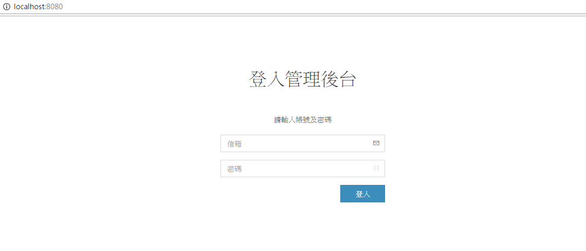
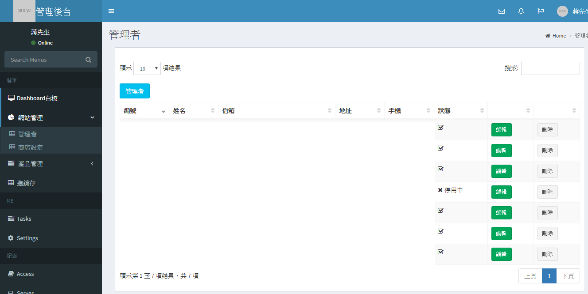

# vue-admin

> A Vue.js project
> In order to quick building the project,i remove authority part. But you need to provide data from backend in other pages, please reference the source code.

##Preview





## Build Setup

``` bash
# install dependencies
npm install

# serve with hot reload at localhost:8080
npm run dev

# build for production with minification
npm run build

# run unit tests
npm run unit

# run e2e tests
npm run e2e

# run all tests
npm test
```
## Reference
- [Vue.js](https://vuejs.org/)
- [Vue-cli](https://github.com/vuejs/vue-cli)
- [Vue-router](https://router.vuejs.org/)
- [Vuex](https://vuex.vuejs.org/)